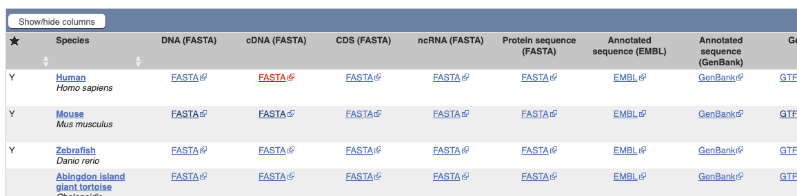
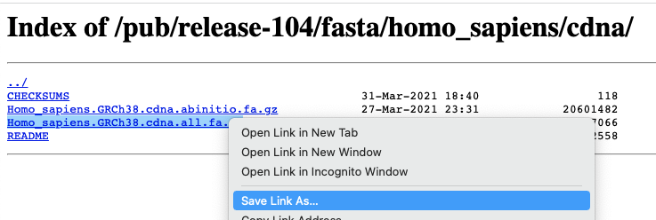
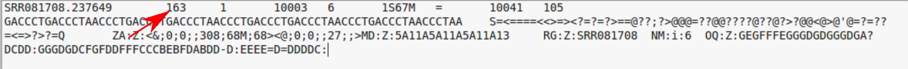

```{r setup, include=FALSE}
knitr::opts_chunk$set(echo = TRUE)
```

# Alignment and Quantification

Two workflows are possible with RNA-seq data - with the difference being whether one performs an alignment to the reference genome or not.

Recent tools for RNA-seq analysis (e.g. `salmon`, `kallisto`) do not require the time-consuming step of whole-genome alignment to be performed, and can therefore produce gene-level counts in a much faster time frame. They not require the creation of large bam files, which is useful if constrained by file space on Galaxy.


(image from Harvard Bioinformatics Core)


We will demonstrate both methods, but for further analysis in R we will use counts that have been generated with `salmon`. 

A much reduced dataset will be used for illustration although the commands used can applied to more-realistic sizes of data.

We first make sure that we are located in the directory with our fastq files

```{bash eval=FALSE}
cd ~/rnaseq_data
ls
```

We will need some reference data for the alignment, and a good place to obtain these data is from Ensembl. 

Links to downloads for a variety of different organisms can be found at https://www.ensembl.org/info/data/ftp/index.html. We can navigate to the particular organism we are interested in through the interface and download the transcript and genome sequences to our laptop. However, we need the reference files to be present on the remote server that we are performing the analysis on.

The command `wget` can be used to download a file from an FTP site to a local directory if you know the path to the file (URL). This path could be obtained by first locating the file in Ensembl and right-clicking to copy the link address.

The homepage of Ensembl FTP index links to reference data for common genomes



Files can be downloaded by clicking on the relevant link. However, we want to download the data using the command line so we have to right-click and select "Copy Link Location" (or similar)



The following commands should download reference data from Ensembl into a newly-created `ref_data` folder. It is good practice to keep your reference data stored in a sub-folder. *However, check first (with I.T or local Bioinformaticians) that you don't have a local copy of reference genomes on your file system*

```{bash eval=FALSE}
mkdir ref_data
wget ftp://ftp.ensembl.org/pub/release-91/fasta/mus_musculus/cdna/Mus_musculus.GRCm38.cdna.all.fa.gz -P ref_data/
wget ftp://ftp.ensembl.org/pub/release-91/gtf/mus_musculus/Mus_musculus.GRCm38.91.chr.gtf.gz -P ref_data
wget ftp://ftp.ensembl.org/pub/release-91/fasta/mus_musculus/dna/Mus_musculus.GRCm38.dna.chromosome.1.fa.gz -P ref_data/
```


## Workflow 1: Quantify the transcripts with salmon

Salmon is a tool for quantifying the expression of transcripts using RNA-seq data. It is based on a new
algorithm that couples the concept of quasi-mapping with a two-phase inference procedure, providing accurate
expression estimates very quickly and using little memory. It quantifies the expression of the transcripts from
a given annotation, so it is not able to identify non annotated genes and transcripts.

The documentation of the tool is available at
https://salmon.readthedocs.io/en/latest/salmon.html

Salmon is able to quantify transcript expression by using a quasi-mapping algorithm. Quasi-mappings are
mappings of reads to transcript positions that are computed without performing a base-to-base alignment
of the read to the transcript. This approach is typically much faster to compute than traditional (or full)
alignments, and can sometimes provide superior accuracy by being more robust to errors in the read or
genomic variation from the reference sequence

`salmon` requires the user to create an index from the `fasta` file of the transcripts. We have to specify a *prefix* name for all the files that `salmon` is going to create. 

```{bash eval=FALSE}
salmon index -i index/GRCm38_salmon -t ref_data/Mus_musculus.GRCm38.cdna.all.fa.gz
```

The quasi-mapping approach of `salmon` can be run with the `salmon quant` command. Help on running this tool can be displayed with the following command.

```{bash eval=FALSE}
salmon quant --help-reads
```

We need to specify the path of the index we have just created in the previous step, locations of our `fastq` files, and the library type (if unsure the option A can be used. See the help page for more options https://salmon.readthedocs.io/en/latest/salmon.html#what-s-this-libtype). We can specify where `salmon` write it's output files to, but this directory does not need to exist prior to running the command.

```{bash eval=FALSE}
salmon quant -i index/GRCm38_salmon --libType A -r SRR1552444.fastq.gz -o quant/SRR1552444

```

> ## Challenge 1 {.challenge}
> 
> Navigate to the quant folder and explore the files that salmon has created.
> What file contains the quantifications? 
> Use the salmon documentation to understand the various output files https://salmon.readthedocs.io/en/latest/file_formats.html#fileformats

### Running for all samples

If we want to repeat the quantification step for all our samples, we could employ a `for` loop as we have seen previously. 

```{bash eval=FALSE}

for filename in *.fastq.gz
do
name=$(basename $filename .fastq.gz)
salmon quant -i index/GRCm38_salmon --libType A -r $filename.fastq.gz -o quant/$name
gzip quant/$name/quant.sf
done

```


## Workflow 2: Align and then count

There are numerous tools performing short read alignment and the choice of aligner should be
carefully made according to the analysis goals/requirements. Here we will use
HISAT2, a fast aligner with low memory requirements that performs spliced alignments. It is the program
suggested for the alignment in the new Tuxedo
protocol (https://doi.org/10.1038/nprot.2016.095) and it requires an indexed genome to keep its memory footprint small and the running
time short. 

The program creates a genome index by using the *FASTA* file of the
sequence we want to use as reference. A sequence in *FASTA* format begins with a single-line
description, followed by lines of sequence data. The description line is distinguished from the
sequence data by a greater-than (`>`) symbol at the beginning.

### Creating a genome index

We have already downloaded the reference file that we want to use. However, it is in a compressed format and not immediately useful for building the genome index. We need to un-compress the file first using the `gunzip` command (similar to `unzip` that we used earlier in the course). This should now replace the file `ref_data/Mus_musculus.GRCm38.dna.chromosome.1.fa.gz` with `ref_data/Mus_musculus.GRCm38.dna.chromosome.1.fa`


The command `hisat2-build` is used to take the reference sequence and create an efficient data structure for searching. We need to specify a *prefix* that will be used to name the files that `hisat2` generates. 

The index step only needs to be run once for a particular genome versions. You can use the same index to align multiple samples.

**Note that the following index procedure may take a few minutes to run**

```{bash eval=FALSE}
gunzip ref_data/Mus_musculus.GRCm38.dna.chromosome.1.fa.gz
hisat2-build ref_data/Mus_musculus.GRCm38.dna.chromosome.1.fa index/GRCm38_chr1_hisat
```


The index files of Mouse genome GRCm38 chromosome 1  should now be in the directory `index/`. All of them have a file name starting with the `GRCm38_chr1_hisat` prefix.

### Alignment with hisat2

There are several parameters we might want to specify in order to align our reads with HISAT2. To view them all type. 


```{bash eval=FALSE}
hisat2 --help
```

To align one of our example files against the *index* that we have just created we need to 

- change the `-x` argument to be the file prefix of all the index files created in the previous step. 
- specify that our reads are *un-paired* and to be found in the file `SRR1552444.fastq.gz`
- specify an output file for the alignments. We will create a new directory to save these alignments to `aligned_reads`

```{bash eval=FALSE}
mkdir aligned_reads
hisat2 -x index/GRCm38_chr1_hisat -U SRR1552444.fastq.gz -S aligned_reads/SRR1552444.sam
```

The output file created is an example of a Sequence Alignment/Map (SAM) file. This is a human-readable file that tells us how well and where each of our sequencing reads aligned.

```{bash eval=FALSE} 
head aligned_reads/SRR1552444.sam
```

After a short section that describes the references sequences used for alignment (here we only have a single chromosome; chromosome 1). There is a tab-deliminted section describing the alignment of each read.


Column | Official Name | Brief
------ | -------------- | -----------
1      | QNAME          | Sequence ID
2      | FLAG           | Sequence quality expressed as a bitwise flag
3      | RNAME          | Chromosome
4      | POS            | Start Position
5      | MAPQ           | Mapping Quality
6      | CIGAR          | Describes positions of matches, insertions, deletions w.r.t reference
7      | RNEXT          | Ref. name of mate / next read
8      | PNEXT          | Postion of mate / next read
9      | TLEN           | Observed Template length
10     | SEQ            | Sequence
11     | QUAL           | Base Qualities

There can also be all manner of optional tags as extra columns introduce by an aligner or downstream analysis tool. A common use is the `RG` tag which refers back to the read groups in the header.


The *"flags"* in the sam file can represent useful QC information

  + Read is unmapped
  + Read is paired / unpaired
  + Read failed QC
  + Read is a PCR duplicate (see later)

The combination of any of these properties is used to derive a numeric value


For instance, a particular read has a flag of 163




### Derivation

There is a set of properties that a read can possess. If a particular property is observed, a corresponding power of 2 is added multiplied by 1. The final value is derived by summing all the powers of 2.


```
 	ReadHasProperty 	Binary 	MultiplyBy
isPaired 	TRUE 	1 	1
isProperPair 	TRUE 	1 	2
isUnmappedQuery 	FALSE 	0 	4
hasUnmappedMate 	FALSE 	0 	8
isMinusStrand 	FALSE 	0 	16
isMateMinusStrand 	TRUE 	1 	32
isFirstMateRead 	FALSE 	0 	64
isSecondMateRead 	TRUE 	1 	128
isSecondaryAlignment 	FALSE 	0 	256
isNotPassingQualityControls 	FALSE 	0 	512
isDuplicate 	FALSE 	0 	1024

```
Value of flag is given by 
```
1x1 + 1x2 + 0x4 + 0x8 + 0x16 + 1x32 + 0x64 + 1x128 + 0x256 + 0x512 + 0x1024 = 163
```

See also

- https://broadinstitute.github.io/picard/explain-flags.html


> ## Challenge 2 {.challenge}
> 
> Use HISAT2 to align one of the other fastq files to chromosome 1 of Mouse GRCm38 (say SRR1552445.fastq) 
> What percentage of reads align?

### Converting to a bam file

`sam` files are easy to read, but rarely used in analysis as they can require large amounts of disk space. The alignments from a sequencing run are more-commonly stored in compressed, binary file know as a `bam` file. Exactly the same information is contained, except they are more portable.

`samtools` is used for the conversion and manipulation of sam and bam files. 

- http://www.htslib.org/

The steps in producing a bam file for analysis are given below. The final step is important as it creates an *index file*. This index needs to be present in order for analysis tools to access the reads in the file in an efficient manner.


```{bash eval=FALSE}
samtools view -bS aligned_reads/SRR1552444.sam > aligned_reads/SRR1552444.bam
samtools sort aligned_reads/SRR1552444.bam -o aligned_reads/SRR1552444.sorted.bam
samtools index aligned_reads/SRR1552444.sorted.bam
```

The `samtools` suite also includes a couple of tools that are useful for QC purposes.

```{bash eval=FALSE}
samtools flagstat aligned_reads/SRR1552444.sorted.bam
samtools idxstats aligned_reads/SRR1552444.sorted.bam
```


### Counting features

We will use the `featureCounts` tool to obtain transcript-level counts for the aligned reads that we have just created. This requires that `gtf` files that we downloaded from Ensembl earlier and our newly-created bam file.


```{bash eval=FALSE}
mkdir featureCounts
featureCounts -a ref_data/Mus_musculus.GRCm38.91.chr.gtf.gz -o featureCounts/SRR1552444.counts aligned_reads/SRR1552444.sorted.bam

```

The command is able to accept multiple bam files

### Running alignment for all `fastq` files

If we wanted to process all the fastq files in our dataset, the following workflow could be employed. This creates a variable `i` that takes all values from 44 to 55 and processes the appropriate fastq file in turn. The `echo` command is used here to print the particular sample that is being processed.

```{bash eval=FALSE}
for filename in *.fastq.gz
do
name=$(basename $filename .fastq.gz)
echo Processing sample $name
hisat2 -x index/GRCm38_chr1_hisat -U $filename -S aligned_reads/$name.sam 
samtools view -bS aligned_reads/$name.sam > aligned_reads/$name.bam
samtools sort aligned_reads/$name.bam -o aligned_reads/$name.sorted.bam
samtools index aligned_reads/$name.sorted.bam
done
```
