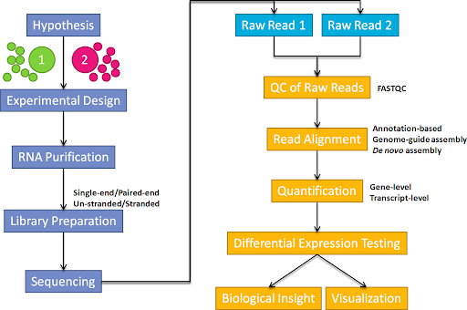
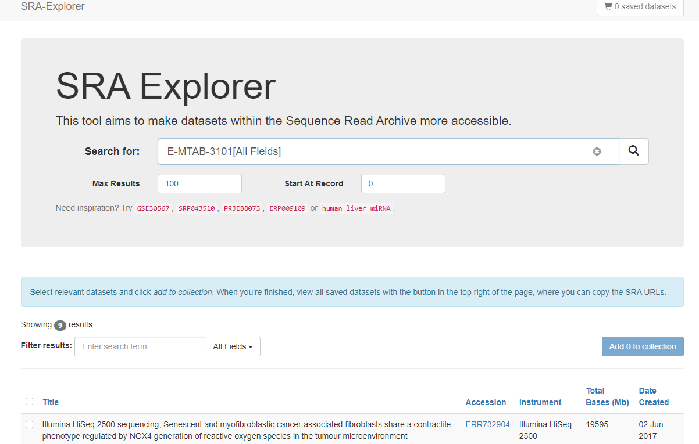

```{r setup, include=FALSE}
knitr::opts_chunk$set(echo = TRUE,eval=FALSE)
```

(Adapted from the Data Carpentry Genomics wrangling materials at:- https://datacarpentry.org/wrangling-genomics/02-quality-control/index.html)

# Overview

Covered in this section

- Using the command line to download files
- Compression and de-compression of files
- Verifying that a download was completed
- Quality assessment of raw sequencing data
- Compiling multiple QC reports into a single file


# Bioinformatics workflows

When working with high-throughput sequencing data, the raw reads you get off of the sequencer will need to pass
through a number of  different tools in order to generate your final desired output. The execution of this set of
tools in a specified order is commonly referred to as a *workflow* or a *pipeline*. 

An example of the workflow we will be using for our RNA-seq analysis is provided below with a brief
description of each step. 




1. Quality control - Assessing quality using FastQC
2. Align reads to reference genome 
3. Quantification to obtain gene-level counts post-alignment clean-up
4. Differential Expression

These workflows in bioinformatics adopt a plug-and-play approach in that the output of one tool can be easily
used as input to another tool without any extensive configuration. Having standards for data formats is what 
makes this feasible. Standards ensure that data is stored in a way that is generally accepted and agreed upon 
within the community. The tools that are used to analyze data at different stages of the workflow are therefore 
built under the assumption that the data will be provided in a specific format.  

**Although we are using RNA-seq as a case study, the initial steps for other NGS technologies are highly-similar**

# Obtaining raw reads

Before we can begin the analysis, we need to make our raw sequencing data accessible within the same computing environment that we are going to use for analysis. Assuming that you will be using a computing node without a GUI, this can be a non-trivial task. For example, we cannot easily drag-and-drop the files from one location to another or click a download link. Therefore we will introduce some commands for transferring files, compressing and de-compressing and checking file integrity.

Lets create a temporary directory to test these tools:-

```{bash eval=FALSE}
cd
mkdir tmp
cd tmp
```


## Use `wget` to download from a remote location

If your data are hosted on a website or FTP site, you can use the `wget` command to download to the current working directory. A small `fastq` file is provided on the Sheffield Bioinformatics Core website as an example. The output updates you on the progress of the download.

Note that if downloading from an FTP site you might be prompted for a username and password.

```{bash eval=FALSE}
wget http://sbc.shef.ac.uk/data/example_reads.fastq
ls -lh
```

The contents of the file can be printed to the screen using the `head` command you should have learnt about previously

```{bash eval=FALSE}
head -n 4 example_reads.fastq
```

## Details on the FASTQ format

Although it looks complicated (and it is), we can understand the
[fastq](https://en.wikipedia.org/wiki/FASTQ_format) format with a little decoding. Some rules about the format
include...

|Line|Description|
|----|-----------|
|1|Always begins with '@' and then information about the read|
|2|The actual DNA sequence|
|3|Always begins with a '+' and sometimes the same info in line 1|
|4|Has a string of characters which represent the quality scores; must have same number of characters as line 2|


```
@SRR2584863.1 HWI-ST957:244:H73TDADXX:1:1101:4712:2181/1
TTCACATCCTGACCATTCAGTTGAGCAAAATAGTTCTTCAGTGCCTGTTTAACCGAGTCACGCAGGGGTTTTTGGGTTACCTGATCCTGAGAGTTAACGGTAGAAACGGTCAGTACGTCAGAATTTACGCGTTGTTCGAACATAGTTCTG
+
CCCFFFFFGHHHHJIJJJJIJJJIIJJJJIIIJJGFIIIJEDDFEGGJIFHHJIJJDECCGGEGIIJFHFFFACD:BBBDDACCCCAA@@CA@C>C3>@5(8&>C:9?8+89<4(:83825C(:A#########################
```


Line 4 shows the quality for each nucleotide in the read. Quality is interpreted as the
probability of an incorrect base call (e.g. 1 in 10) or, equivalently, the base call
accuracy (e.g. 90%). To make it possible to line up each individual nucleotide with its quality
score, the numerical score is converted into a code where each individual character
represents the numerical quality score for an individual nucleotide. For example, in the line
above, the quality score line is:

```
CCCFFFFFGHHHHJIJJJJIJJJIIJJJJIIIJJGFIIIJEDDFEGGJIFHHJIJJDECCGGEGIIJFHFFFACD:BBBDDACCCCAA@@CA@C>C3>@5(8&>C:9?8+89<4(:83825C(:A#########################
```

The numerical value assigned to each of these characters depends on the
sequencing platform that generated the reads. The sequencing machine used to generate our data
uses the standard Sanger quality PHRED score encoding, using Illumina version 1.8 onwards.
Each character is assigned a quality score between 0 and 41 as shown in
the chart below.

```
Quality encoding: !"#$%&'()*+,-./0123456789:;<=>?@ABCDEFGHIJ
                   |         |         |         |         |
Quality score:    01........11........21........31........41
```

Each quality score represents the probability that the corresponding nucleotide call is
incorrect. This quality score is logarithmically based, so a quality score of 10 reflects a
base call accuracy of 90%, but a quality score of 20 reflects a base call accuracy of 99%.
These probability values are the results from the base calling algorithm and depend on how
much signal was captured for the base incorporation.


```
@SRR2584863.1 HWI-ST957:244:H73TDADXX:1:1101:4712:2181/1
TTCACATCCTGACCATTCAGTTGAGCAAAATAGTTCTTCAGTGCCTGTTTAACCGAGTCACGCAGGGGTTTTTGGGTTACCTGATCCTGAGAGTTAACGGTAGAAACGGTCAGTACGTCAGAATTTACGCGTTGTTCGAACATAGTTCTG
+
CCCFFFFFGHHHHJIJJJJIJJJIIJJJJIIIJJGFIIIJEDDFEGGJIFHHJIJJDECCGGEGIIJFHFFFACD:BBBDDACCCCAA@@CA@C>C3>@5(8&>C:9?8+89<4(:83825C(:A#########################
```


Since this file is so small, we needn't worry about the file size. However, in a real life experiment our raw sequencing reads can be many 10s of Gb in size. It is common practice to compress the file so that it takes less space on disk. The standard way of achieving this in Unix systems is to use the `gzip` command. A side-effect of the compression is that the resulting file can no longer be printed with `cat`. However, a `zcat` command can be used to the same effect.

```{bash eval=FALSE}
##example of compressing the file
gzip example_reads.fastq
## list the directory to see what changed...
ls -lh
## Now have to use zcat to print...
zcat example_reads.fastq | head -n4
```


## Download an archived directory

Another popular technique for compressing and transfering a collection of files is to organise them into a single file (or *tarball*), which can then be compressed. Such a file is also available on the Sheffield Bioinformatics Core website for demonstration purposes. The `wget` command can be used as before.

```{bash eval=FALSE}
wget http://sbc.shef.ac.uk/data/archive.tar.gz
ls
```

The `tar` command with the options `zxvf` (look these up if you want to understand more) can be used to create a directory structure containing all the files.

```{bash eval=FALSE}
tar zxvf archive.tar.gz
ls
```


### Checking the download worked

Having downloaded all your files, you should probably check they have been downloaded successfully and been corrupted in transit. Partial or incomplete files can be a source of errors later on in the analysis. If you are downloading many files, it can be difficult to spot if a file failed to download. A simple way is to check the file sizes, but this can be unreliable.

A common way of doing this is to generate an *md5sum* from the file. You can think of this as a unique digital barcode of a text file. The same file will always give the same md5sum. Sequencing vendors will often calculate these files on their servers and send the results to you in the form of a text file that you can use to check. Note that for large fastq files, these can take several minutes to compute.

```{bash eval=FALSE}
### show md5sum for a particular file
md5sum fastq/Sample1/Sample1.fastq
## help is available on the function
md5sum --help
```

To see what would happen if a file didn't transfer properly, we can create a copy of `Sample1.fastq` containing fewer lines. The resulting md5sum will be different

```{bash}
## Use > to redirect the output
head fastq/Sample1/Sample1.fastq > fastq/Sample1/Sample1_sub.fastq
md5sum fastq/Sample1/Sample1_sub.fastq
```

## Challenge 1 {.challenge}

<div class="exercise">
 1. Download the pre-computed md5sums available at `http://sbc.shef.ac.uk/data/archive_md5.txt`. 
 2. Print the contents of this file and verify that the sum for Sample1.fastq is correct
 3. The md5sum command is able to check the md5sums for a collection of files against some pre-computed values. Use documentation (and google!) to discover how to do this for the files we have downloaded.
</div>


##  Obtaining public data

A good resource for obtaining public data is the SRA explorer.

- [https://sra-explorer.info/](https://sra-explorer.info/)

In the Search box you can enter the accession number of a study (usually quoted in the published paper), to obtain download links for all the fastq files. It will even generate a bash script for you to run. 

The data for this tutorial comes from the paper, [*Induction of fibroblast senescence generates a non-fibrogenic myofibroblast phenotype that differentially impacts on cancer prognosis.*](http://europepmc.org/article/MED/27992856). 

> Cancer associated fibroblasts characterized by an myofibroblastic phenotype play a major role in the tumour microenvironment, being associated with poor prognosis. We found that this cell population is made in part by senescent fibroblasts in vivo. As senescent fibroblasts and myofibroblasts have been shown to share similar tumour promoting functions in vitro we compared the transcriptosomes of these two fibroblast types and performed RNA-seq of human foetal foreskin fibroblasts 2 (HFFF2) treated with 2ng/ml TGF-beta-1 to induce myofibroblast differentiation or 10Gy gamma irradiation to induce senescence. We isolated RNA 7 days upon this treatments changing the medium 3 days before the RNA extraction.


The paper states a particular *accession number* that can be used to access the data

- **E-MTAB-3101**

This ID can be used to find the data on ArrayExpress, but is also recognised by SRA explorer (you don't need the **[All fields]** text shown in the screenshot). Gene Expression Omnibus (**GSE..**) or Sequencing Read Archive (**SRP...**) identifiers are also recognised.



If the identifier is recognised the names of samples belonging to the dataset will be shown. These can be selected and added to a collection. From the saved datasets button (top-right) the user can then access download links.

For this particular dataset we created a download script using the links provided by SRA explorer. To keep the run-time of the workshop short (and to keep computing requirements down), each raw file was subset to a more manageable amount.

<div class="information">
The code used to download the example dataset can be found in `/home/dcuser/rnaseq_data/scripts/download_subset.sh`. You do not need to run this as part of the workshop - it is just for information, or if you wanted to repeat the workshop in your own environment.
</div>

### Using sharc (**UoS-specific**)

The University of Sheffield has a High-performance Computing (HPC) cluster called [ShARC](https://www.sheffield.ac.uk/cics/research/hpc/sharc) that you will probably use to perform your analysis. 

FTP software such as Cyberduck (Mac OSX), WinSCP (Windows) or Filezilla will allow you to connect and copy the files in a drag-and-drop manner.


You can also copy files to this cluster from your own machine with the secure copy (`scp`) command or `rsnyc`.

```{bash eval=FALSE}
scp archive.tar.gz md1mjdx@sharc.shef.ac.uk:/shared/bioinformatics_core1/Shared/work
```

Your research group may already have storage space on ShARC that is accesible from your desktop, in which case you can drag and drop files. See the UoS website for more information on this storage [https://www.sheffield.ac.uk/cics/research-storage](https://www.sheffield.ac.uk/cics/research-storage)


# Assessing Quality using FastQC

In real life, you won't be assessing the quality of your reads by visually inspecting your 
FASTQ files. Rather, you'll be using a software program to assess read quality and 
filter out poor quality reads. We'll first use a program called [FastQC](http://www.bioinformatics.babraham.ac.uk/projects/fastqc/) to visualize the quality of our reads. 
Later in our workflow, we'll use another program to filter out poor quality reads. 

FastQC has a number of features which can give you a  quick impression of any problems your
data may have, so you can take these issues into consideration before moving forward with your
analyses. Rather than looking at quality scores for each individual read, FastQC looks at
quality collectively across all reads within a sample. The image below shows a FastQC-generated plot that indicates
a very high quality sample:


The x-axis displays the base position in the read, and the y-axis shows quality scores. In this
example, the sample contains reads that are 40 bp long. For each position, there is a 
box-and-whisker plot showing the distribution of quality scores for all reads at that position.
The horizontal red line indicates the median quality score and the yellow box shows the 2nd to
3rd quartile range. This means that 50% of reads have a quality score that falls within the
range of the yellow box at that position. The whiskers show the range to the 1st and 4th 
quartile.

For each position in this sample, the quality values do not drop much lower than 32. This 
is a high quality score. The plot background is also color-coded to identify good (green),
acceptable (yellow), and bad (red) quality scores.

Now let's take a look at a quality plot on the other end of the spectrum. 


Here, we see positions within the read in which the boxes span a much wider range. Also, quality scores drop quite low into the "bad" range, particularly on the tail end of the reads. The FastQC tool produces several other diagnostic plots to assess sample quality, in addition to the one plotted above. 

## Running FastQC  

We will be working with a set of sample data that is located in the directory (`rnaseq_data`). These files have been compressed, so have the `fastq.gz` extension. FastQC is happy with either compressed on un-compressed files.


Navigate to your FASTQ dataset: 

```{bash eval=FALSE}
cd /home/dcuser/rnaseq_data
```


To run the FastQC program, we would normally have to tell our computer where the program is located. In this particular case, FastQC has been installed in a location that can be accessed from all directories. 

```{bash eval=FALSE}
which fastqc
```

```
/usr/bin/fastqc
```

**This is the first program we have seen that is specific to NGS analysis, so might not be available on all file systems by default.**

FastQC can accept multiple file names as input, so we can use the `*.fastq.gz` wildcard to run FastQC on all of the FASTQ files in this directory.

```{bash eval=FALSE}
fastqc fastq/*.fastq.gz
```


You will see an automatically updating output message telling you the 
progress of the analysis. It will start like this: 


```
Started analysis of ERR732901_sub.fastq.gz
Approx 100% complete for ERR732901_sub.fastq.gz
Analysis complete for ERR732901_sub.fastq.gz

```

In total, it should take less than 1 minute for FastQC to run on all
of our FASTQ files. When the analysis completes, your prompt
will return. So your screen will look something like this:

```
Started analysis of ERR732909_sub.fastq.gz
Approx 100% complete for ERR732909_sub.fastq.gz
Analysis complete for ERR732909_sub.fastq.gz

```

The FastQC program has created several new files within our
`/data/fastq` directory. 

```{bash eval=FALSE}
ls fastq/
```


```
ERR732901_sub.fastqc.html    ERR732901_sub.fastqc.zip     ERR732901_sub.fastq.gz     ERR732901_sub.fastqc.html     
....
```


For each input FASTQ file, FastQC has created a `.zip` file and a
`.html` file. The `.zip` file extension indicates that this is 
actually a compressed set of multiple output files. We'll be working
with these output files soon. The `.html` file is a stable webpage
displaying the summary report for each of our samples.

We want to keep our data files and our results files separate, so we
will move these output files into a new directory within our `results/` directory. If this directory does not exist, we will have to create it.

```{bash eval=FALSE}
## -p flag stops a message from appearing if the directory already exists
mkdir -p qc
mv fastq/*.html qc/
mv fastq/*.zip qc/
```


## Combining the reports with `multiqc`

It can be quite tiresome to click through multiple QC reports and compare the results for different samples. It is useful to have all the QC plots on the same page so that we can more easily spot trends in the data.

The multiqc tool has been designed for the tasks of aggregating qc reports and combining into a single report that is easy to digest.

```{bash eval=FALSE}
multiqc
multiqc --help
```


## Challenge 2 {.challenge}

<div class="exercise"> 
Use the multiqc tool to create a single QC report for the dataset.
Look at the help for the tool, and figure out how to run the tool on the fastqc output we have just generated. Make sure that `multiqc` creates saves the report file in the `qc` folder.
</div>

The environment that we are working inside includes a version of the Firefox web browser. We can open a particular HTML file with firefox using the command:-

```
firefox qc/ERR732901_sub.fastqc.html
```

If this doesn't work, there is a File Explorer tool available in the desktop environment that you can use to navigate to, and view the files.

## Challenge 3 {.challenge}
<div class="exercise"> 
Discuss your results with a neighbour. 
- Which samples most the highest / lowest number of reads
- Which sample(s) looks the best in terms of per base sequence quality? - Which sample(s) look the worst?
</div>

<a href="part3.nb.html" style="font-size: 50px; text-decoration: none">Click Here for next part</a>