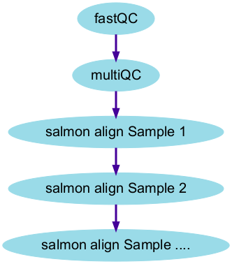

```{r setup, include=FALSE}
knitr::opts_chunk$set(echo = TRUE,eval=FALSE)
```

# Next steps in the pipeline

Once we are happy with the QC or our data, the next steps in an NGS analysis is usually to align your samples to a reference genome. We have supplied a couple of required files in the `/home/dcuser/rnaseq_data/ref_data` folder.

```{}
ls /home/dcuser/rnaseq_data/ref_data
```


## Obtaining reference data

Links to downloads for a variety of different organisms can be found at https://www.ensembl.org/info/data/ftp/index.html. We can navigate to the particular organism we are interested in through the interface and download the transcript and genome sequences to our laptop. 

<div class="information">
If you are running this workshop in-person using the cloud-based environment, make sure to use web-browse within the environment to access the Ensembl FTP site.
</div>

The command `wget` can be used to download a file from an FTP site to a local directory if you know the path to the file (URL). This path could be obtained by first locating the file in Ensembl and right-clicking to copy the link address.

The homepage of Ensembl FTP index links to reference data for common genomes


Files can be downloaded by clicking on the relevant link. However, we want to download the data using the command line so we have to right-click and select "Copy Link Location" (or similar)


## Exercise
<div class="exercise">
We will need the Human reference genome sequence for chromosome 22 from the DNA (FASTA) section. Download the repeat-masked (`rm`) version of this sequence to the `ref_data` folder, and extract the contents of the file using `gzip`.

</div>


### More recommendations on downloading reference data

<div class="information">
*To avoid duplication. check first (with I.T or local Bioinformaticians) that you don't have a local copy of reference genomes on your file system*
</div>


<div class="information">
We also recommend obtaining reference genomes from the AWS iGenomes project

- [https://ewels.github.io/AWS-iGenomes/](https://ewels.github.io/AWS-iGenomes/)

This project provides a stable and versioned resource for obtaining many reference genomes. Moreover, it has a convenient command-based interface for downloading the genomes. As it is capable of downloading large volumes of data we will not be using it in the workshop.

```
aws-igenomes.sh
```

</div>

## Alignment of NGS data

The general procedure of aligning of our sequencing reads is illustrated below:-


There are numerous tools available for aligning sequencing reads, and main consideration is the type of sequencing experiement being performed (e.g. DNA-seq vs RNA-seq etc). Each tool also requires you to build an **index** from the genome reference file.

Or recommended tool for RNA-seq is `salmon` and the particular command for one sample is:-

```{bash}
salmon quant -i index/GRCh38_salmon --libType A -r fastq/ERR732901_sub.fastq.gz -o quant/ERR732901
```

Where 

- `fastq/ERR732901_sub.fastq.gz ` contains the data for the particular biological sample
- `index/GRCh38_salmon` contains the processed reference genome
- `quant/ERR732901` is where we want to output to be created
- `libType A` is a specific argument for salmon specifying what type of RNA-seq has been performed.


# Why do we need a pipeline? How might we create one?

We have now learnt a few commands that, when joined together, can form the basis for a minimal analysis pipeline

- use `fastqc` to create QC reports for each sample
- use `multiqc` to combine the QC
- align our data using `salmon`

The next natural step would be to record these commands in a *script* so that we can document our analysis and re-run as required. We don't usually have a text editor in our Unix environment, so it is good practice to create and edit the script using the command-line. The `nano` editor is commonly-found on Unix systems and running the command `nano` with a file name will create that file if it does not exist.

```{bash}
nano analysis_script.sh
```

**Enter the following in the nano window that appears**

```{bash}
fastqc fastq/*.fastq.gz
mkdir -p qc/
mv fastq/*.html qc/
mv fastq/*.zip qc
multiqc -f -o qc/ qc
```

Press **CTRL + X** following by **Y** (when asked if you want to save the modified buffer) to return to the terminal.

We can execute the script using the `bash` command

```{bash}
## remove qc directory first, so we can see the script in action
rm -r qc/
ls -l
bash analysis_script.sh
```

This will run through the QC steps of the pipeline. The next stage would be to add the steps for `salmon` quantification.

```{bash}
salmon quant -i index/GRCh38_salmon --libType A -r fastq/ERR732901_sub.fastq.gz -o quant/ERR732901
```


We also have a number of options for how to proceed with quantifying the remaining samples. The simplest approach copy-and-paste the `salmon quant` line with different sample names

```{bash}
salmon quant -i index/GRCh38_salmon --libType A -r fastq/ERR732902_sub.fastq.gz -o quant/ERR732902
salmon quant -i index/GRCh38_salmon --libType A -r fastq/ERR732903_sub.fastq.gz -o quant/ERR732903
###etc....

```

This is not particularly satisfactory as it is prone to typo errors. Our pipeline is already quite short and is running on a small dataset, but already it is taking a little while to run. The pipeline has been written in a linear fashion, so that each step must be completed in order. If our salmon alignment code needed to be changed we would have to re-run all the QC. This is not a huge problem here, but could be quite inefficient for a more-realistic dataset.


The order in which our various tools are being run can be visualised as follows:- 

```{r echo=FALSE}
library(tidyverse)  # for %>% pipes
library(DiagrammeR)
library(DiagrammeRsvg)  # for conversion to svg
library(rsvg)  # for saving svg


g <- grViz(diagram = "digraph flowchart {
      # define node aesthetics
      node [fontname = Arial, shape = oval, color = '#9ADBE8', style = filled, fontsize =20]  
      edge [color = '#440099', penwidth=3]
      
      node [fillcolor = '#9ADBE8']
      
      tab2 [label = 'fastQC']
      tab3 [label = 'multiQC']
      tab4 [label = 'salmon align Sample 1']
      tab5 [label = 'salmon align Sample 2']
      tab6 [label = 'salmon align Sample ....']
      
      tab2 -> tab3;
      tab3 -> tab4;
      tab4 -> tab5;
      tab5 -> tab6;

}")

g
g %>% 
  export_svg() %>% 
  charToRaw %>% 
  rsvg_png("images/flowchart1.png")

```


An alternative might be to employ a *for loop*, which you might have [come across previously](https://datacarpentry.org/shell-genomics/04-redirection/index.html). This will make our code more efficient, but still not help with running our analysis in an efficient manner. 

There is no particular reason why we should wait for Sample 1 to be processed before Sample 2 and Sample 2 before Sample 3 etc. Ideally, we would want to process all our samples at the same time. This is achievable is we run our analysis where we have several processors available; such as a *HPC* (High-Performance Computer) or computing cluster.

```{r echo=FALSE}
g <- grViz(diagram = "digraph flowchart {
      # define node aesthetics
      node [fontname = Arial, shape = oval, color = '#9ADBE8', style = filled, fontsize =20]  
      edge [color = '#440099', penwidth=3]
      
      node [fillcolor = '#9ADBE8']
      
      tab2 [label = 'fastQC']
      tab3 [label = 'multiQC']
      tab4 [label = 'salmon align Sample 1']
      tab5 [label = 'salmon align Sample 2']
      tab6 [label = 'salmon align Sample ....']
      
      tab2 -> tab3;
      tab3 -> tab4;
      tab3 -> tab5;
      tab3 -> tab6;

}")

g
g %>% 
  export_svg() %>% 
  charToRaw %>% 
  rsvg_png("images/flowchart2.png")

```


# Why do we need a workflow manager

As we have discussed, there are a number of options to extend our pipeline to multiple samples. These require more programming knowledge than we might be comfortable with. There are a few other issues with the script that we have created.

- As pipeline steps have to be re-run in sequence; even if the initial pipeline steps ran sucessfully they will still be re-run every time
- The pipeline will not neccesarily run on another environment as it will assume that the `fastqc`, `multiqc` and other tools can be found.

Neither of these issues are impossible to solve, but this isn't intended to be a workshop on software development best-practice. 

**In reality, we would recommend people re-using existing analysis pipelines rather than writing their own**. We will look at an example using the nextflow workflow manager, although similar tools such as snakemake are also popular in Bioinformatics

- [nextflow](https://www.nextflow.io/)
- [snakemake](https://snakemake.readthedocs.io/en/stable/)

## Running a nf.core pipeline

In our opinion, nextflow is particular appealing as many popular Bioinformatics pipelines have already been written using nextflow and have been distributed as part of the nf.core project

- [nf.core homepage](https://nf-co.re/)

We will be showing the RNA-seq pipeline in particular


- [nf.core RNA-seq pipeline](https://nf-co.re/rnaseq)


The minimum number of options required to run an nf.core pipeline such as RNA-seq are:-

```{bash}
nextflow run nf-core/rnaseq --input samplesheet.csv --outdir <OUTDIR> --genome GRCh37 -profile docker
```

where:-

- `nf-core/rnaseq` is a reference to the pipeline that we want to run
- `--input` is the location of a samplesheet defining the raw data to be processed
- `--outdir` is a directory that will contain the final results of the pipeline
- `genome` is the shorthand name for the genome to be used as a reference
- `profile` defines how software included in the pipeline is to be downloaded/installed (**See later**)

We have customised some of the options of the pipeline so run a reduced number of steps are run for the workshop, and using a custom genome containing a single chromosome.

```{bash}
cat scripts/run_nextflow.sh
```

The particular steps that we have modified are as follows:-

```
##use a particular pipeline version
-r 3.8.1 \
## Skip aligning to the whole genome
--skip_alignment \
## Skip trimming read sequences
--skip_trimming \
## use the salmon quantification tool
--pseudo_aligner salmon \
## Use our own set of references rather than downloading
--fasta ref_data/Homo_sapiens.GRCh38.dna_rm.chromosome.22.fa \
--transcript_fasta ref_data/Homo_sapiens.GRCh38.cdna.chr22.fa \
--gtf ref_data/Homo_sapiens.GRCh38.108.chr22.gtf \
## restrict the amount of memory requested \
--max_memory 2GB
```

The files that we want to analyse are defined in a sample sheet. The format of the sheet is checked by the pipeline as one of the first steps. The column names have to match *exactly* what the pipeline expects.

```{bash}
cat nf_samplesheet.csv
```


Before we can run the pipeline we need to move (or copy) the script to the working folder

```{bash}
cp scripts/run_nextflow.sh /data
bash run_nextflow.sh
```


The output from the workflow will be written to a directory `nf_results`, which doesn't need to exist before the pipeline has been run. You should also see that a `work` directory is created.


## Exercise
<div class="exercise">
**Exercise**
Run the script `run_nextflow.sh` (around ~5 to 10 minutes) and afterwards look at the output in the `nf_results` folder and familiarise yourself with the outputs. What extra steps have been performed in addition to the script that we created earlier?
</div>

## What software does nextflow use in it's pipeline?

You should notice that the nf.core pipeline has produced quantification files for each sample, and also combined the `salmon` outputs into a single file. It also run some QC plots from the DESeq2 R package. However, R is not part of our software environment. We can see this by running the following commands which would usually report the path that R is located at, or run the command-line R.


```
which R
R
```

nextflow has it's own way of installing and running software which does not depend on the operating system that is being used to run the pipeline. This is specified by this part of the run script.

- [nf.core profile options](https://nf-co.re/rnaseq/3.9/usage#profile)

```
-profile singularity 
```

In fact, we could have run the pipeline if we didn't have `salmon` and `fastqc` installed. The implication of this being that you can re-run the pipeline on your own machine or HPC environment with minimal software installation. The only dependancies are `nextflow` itself (which in turn requires `java`) and some *containerisation* or package management software such as `singularity`, `docker` or `conda`. This is a significantly easier requirement to fulfill than having to install each piece of software individually.

<div class="information">
If you are using a HPC environment you will probably want to keep the singularity option in the profile. 
</div>

## Re-running the pipeline

<div class="exercise">
**Exercise**
There are two fastq files in our `fastq` folder that have not yet been analysed; `ERR732908` and `ERR732909`. Make a copy of the samplesheet `nf_samnplesheet.csv` and use the `nano` editor to modify the new samplesheet to include `ERR732908`. Now edit the run script to use this new samplesheet and re-run the pipeline. What do you notice about the time taken to run the pipeline?
</div>


The pipeline should be quicker this time around. This is because we had all the software downloaded and installed from the previous run. However, it still re-analysed the first seven samples from the samplesheet - which is not ideal. If we want a report on what analyses have been performed and how long they took we can look at a report from the command-line

```
## You will have to use auto-complete and choose the most-recent report
cat nf_results/pipeline/execution_trace
```
There is also a HTML version of the report that we can view through the file system.

## Resuming a pipeline

Ideally, we would like the pipeline to detect what jobs have been run successfully and not repeat those jobs. The option `-resume` in nextflow will allow you to do this. (note the single `-` when adding this option). Modify the nextflow script with `nano` to contain the following lines at the top

```
nextflow run nf-core/rnaseq -profile singularity \
-resume \
-r 3.8.1 \
....

```

We can now edit the samplesheet again to process the sample `ERR732909` 

```
sample,fastq_1,fastq_2,strandedness
ERR732901,fastq/ERR732901_sub.fastq.gz,,unstranded
ERR732902,fastq/ERR732902_sub.fastq.gz,,unstranded
ERR732903,fastq/ERR732903_sub.fastq.gz,,unstranded
ERR732904,fastq/ERR732904_sub.fastq.gz,,unstranded
ERR732905,fastq/ERR732905_sub.fastq.gz,,unstranded
ERR732906,fastq/ERR732906_sub.fastq.gz,,unstranded
ERR732907,fastq/ERR732907_sub.fastq.gz,,unstranded
ERR732908,fastq/ERR732908_sub.fastq.gz,,unstranded
ERR732909,fastq/ERR732909_sub.fastq.gz,,unstranded
```


and re-run the pipeline. 

```
bash run_nextflow.sh
```

The pipeline now runs significantly quicker because it detects that all the analyses have been completed and *cached*. If we check the `execution_trace` text file for this latest run it should say that most tasks were `CACHED` - meaning that the results from the previous analysis was used.
